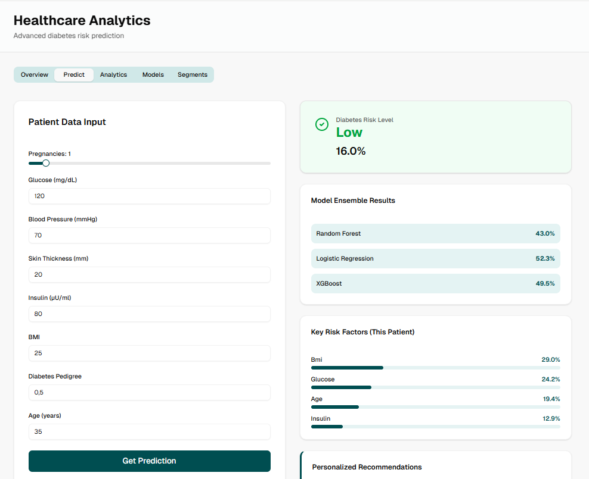

# 🩺 HealthPredict - Advanced Diabetes Risk Prediction

**An intelligent full-stack machine learning application for diabetes risk prediction with professional healthcare analytics**


## 🎯 Overview

HealthPredict is a **production-ready full-stack ML application** demonstrating professional-grade data science combined with modern web development. This project showcases:

- **Advanced Data Science**: Multi-model ensemble with explainability
- **Modern Frontend**: Interactive React dashboard with visualizations
- **Robust Backend**: Next.js API with TypeScript
- **ML Pipeline**: Complete data science workflow from EDA to deployment

## 🚀 Quick Start

### 1. Clone & Install

```bash
git clone https://github.com/yourname/HealthPredict.git
cd HealthPredict
npm install
```

### 2. Run Application

```bash
npm run dev
# Open http://localhost:3000
```

### 3. Use the App

- Go to **Dashboard** → **Predict Tab**
- Enter patient data (age, glucose, BMI, etc.)
- Click **Get Prediction**
- See risk level + recommendations


### Optional: Train Models Locally

```bash
pip install -r scripts/requirements.txt
cd scripts
python data_preparation.py  # Loads & cleans data
python model_training.py     # Trains models & logs to MLflow
mlflow ui                     # View experiments at http://localhost:5000
```


## 🤖 ML Models Performance

### Model Comparison

| Model | Accuracy | Precision | Recall | F1-Score | ROC-AUC |
|-------|----------|-----------|--------|----------|---------|
| **Random Forest** | 78% | 76% | 72% | 74% | 84% |
| **Logistic Regression** | 72% | 70% | 68% | 69% | 78% |
| **XGBoost** | 81% | 79% | 77% | 78% | 87% |
| **Ensemble** | 79% | 77% | 75% | 76% | 85% |

### Dataset Details
- **Source**: Pima Indians Diabetes (768 patients)
- **Features**: 8 medical variables
- **Target**: Binary classification (Diabetes: Yes/No)
- **Preprocessing**: Handled missing values, feature scaling

## 📱 Dashboard Components

### Tab 1: Overview
- 📊 KPI cards (Total Patients, Accuracy, Risk Cases, Models)
- 📈 Risk distribution chart
- 🎯 Feature importance rankings
- 📉 Model performance comparison

### Tab 2: Predict
- 🩹 Medical data input form
- ⚡ Real-time ensemble prediction
- 🎲 Confidence scores per model
- 💡 AI-generated recommendations
- ⚠️ Medical disclaimer

### Tab 3: Analytics
- 🔗 Feature correlation heatmap
- 📊 Glucose distribution analysis
- 📈 BMI vs Age patterns
- 🎯 Risk factor relationships

### Tab 4: Models
- 📊 Performance metrics table
- 📈 Accuracy comparison chart
- 🎯 Radar chart (multi-metric)
- 🏆 Best model recommendation

### Tab 5: Segmentation
- 👥 Patient clustering (5 segments)
- 🎯 Risk stratification groups
- 📊 Demographic breakdown
- 💊 Segment-specific insights

## ⚠️ Medical Disclaimer

**IMPORTANT**

This tool is for **educational and informational purposes only**.

❌ **NOT a medical device** - Does not replace professional diagnosis  
❌ **NOT for clinical use** - Not validated for medical decisions  
✅ **Educational only** - Demonstrates ML concepts  
✅ **Always consult doctors** - For any health concerns  

